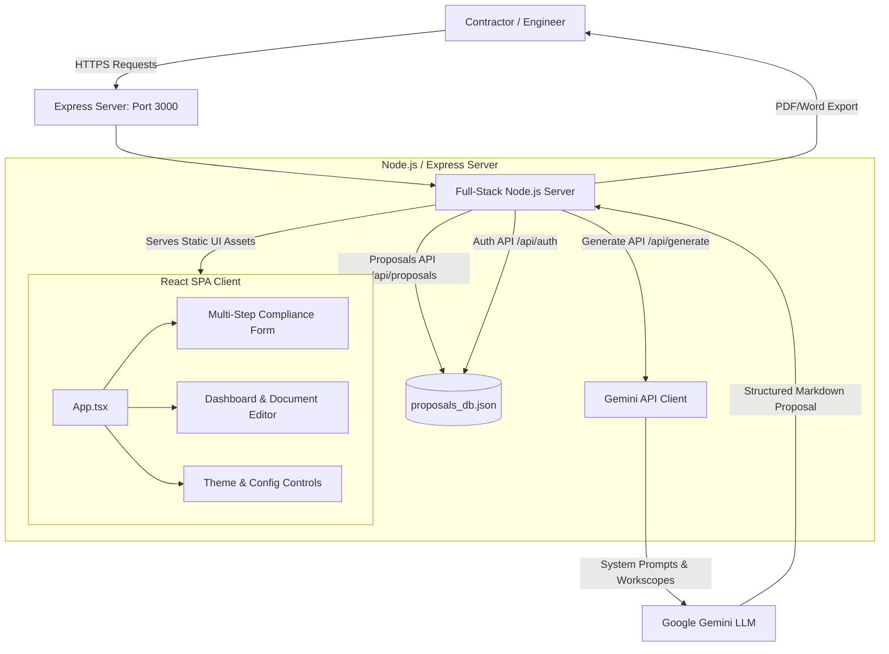
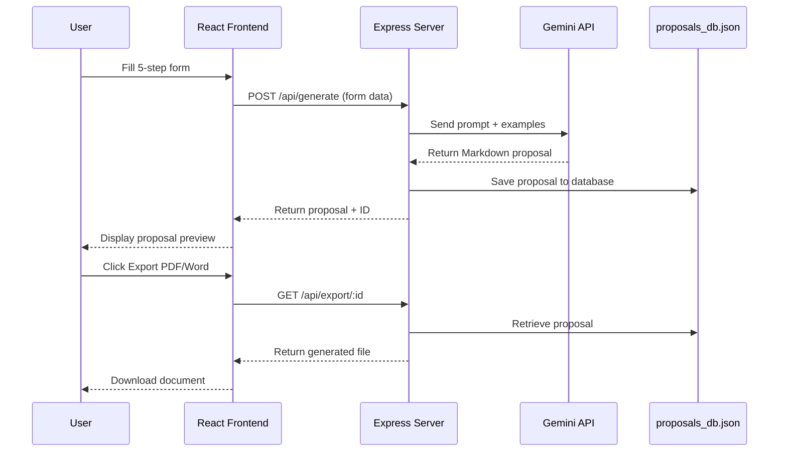

# ⚡ AS/NZS 3000 Electrical Compliance & Estimating Platform

[](https://github.com/life2allsofts/Electrical-Proposal-Generator/actions/workflows/ci-cd.yml)
[](https://huggingface.co/spaces/tetteh-apotey/Electrical-Proposal-Generator)


**Live Demo:** https://tetteh-apotey-Electrical-Proposal-Generator.hf.space/

## 📋 Overview

An advanced full-stack platform designed for senior Australian electrical engineers and registered contractors to draft, manage, refine, and export professional compliance-checked electrical engineering proposals.

The application streamlines form-driven capture of site variables, models core workscopes (such as Switchboard Upgrades, EV Charger installations, and Lighting Retrofits), verifies compliance with Australian Wiring Rules (**AS/NZS 3000:2018**), orchestrates prompt templates via an AI backend, tracks full local document iteration through **Revision History**, and exports blueprints to PDF and MS Word formats.

---

## 🏗️ Architecture Diagrams

### System Architecture Flow

Below is the request-response and data orchestration lifecycle within the application:



### Data Flow: Proposal Generation



---

## 📁 Project Directory Structure

The workspace is a **single-command full-stack application**. It uses a modular **Vite + React** client inside `/src`, and an orchestrating **Node.js Express** server at `server.ts` that serves as a secure API gateway for Gemini AI integration and local state management.

```text
├── .env.example                # Sample environment configuration
├── .gitignore                  # Untracked build artifacts
├── index.html                  # HTML shell for React
├── metadata.json               # Platform configuration metadata
├── package.json                # Dependency manifest & scripts
├── proposals_db.json           # JSON database (users + proposals)
├── server.ts                   # Express backend & API gateway
├── tsconfig.json               # TypeScript configuration
├── vite.config.ts              # Vite bundler configuration
│
├── config/
│   └── prompts.json            # Editable AI prompt templates
│
├── assets/                     # Images and static resources
│
└── src/
    ├── main.tsx                # React bootstrap
    ├── index.css               # Global Tailwind styles
    ├── index.tsx               # React DOM render
    ├── types.ts                # TypeScript interfaces
    ├── App.tsx                 # Main React application
    │
    └── components/
        ├── Login.tsx           # Authentication (register/sign-in)
        ├── ThemeToggle.tsx     # 4-color theme switcher
        │
        ├── MultiStepForm/
        │   ├── Step1_JobDetails.tsx
        │   ├── Step2_Materials.tsx
        │   ├── Step3_Labour.tsx
        │   ├── Step4_SiteConditions.tsx
        │   └── Step5_Review.tsx
        │
        └── Dashboard/
            ├── ProposalList.tsx
            └── ProposalEditor.tsx
```

---

## 📝 File Responsibility Dictionary

### Root Configuration

| File | Purpose |
|------|---------|
| `server.ts` | Main Express server. Handles user auth, proposal CRUD, Gemini API proxy, PDF/Word export, and serves static frontend files. |
| `package.json` | Dependencies: `@google/genai`, `express`, `lucide-react`, `motion`, plus build scripts for Vite + esbuild. |
| `proposals_db.json` | Lightweight JSON storage for user accounts and saved proposals. Persists across restarts. |
| `vite.config.ts` | Bundler configuration for React + TypeScript with HMR. |

### Frontend Application Layer

| File | Purpose |
|------|---------|
| `src/types.ts` | Global TypeScript interfaces: `Proposal`, `Revision`, `FormData`, `UserSession`. |
| `src/App.tsx` | Main state manager: tab navigation, form data buffer, authentication state, API coordination. |
| `src/index.css` | Tailwind + 4 custom themes (Ambient Slate, Cyber Neon, Electric Volt, Monochrome). |

### React Components

| Component | Purpose |
|-----------|---------|
| `Login.tsx` | Registration and sign-in forms. Stores JWT in localStorage. |
| `ThemeToggle.tsx` | Cycles through 4 color themes. Persists preference. |
| `MultiStepForm/` | Five-step questionnaire: Job Details → Materials → Labour → Site Conditions → Review. |
| `Dashboard/ProposalList.tsx` | Displays saved proposals with search, filter, and duplicate actions. |
| `Dashboard/ProposalEditor.tsx` | Dual-view editor (Markdown preview / raw text) with Revision History panel and checkpoint system. |

---

## 🛠️ Setup Guide

### 1. Prerequisites

- Node.js (v18.x or higher)
- npm (v9.x or higher)

### 2. Environment Setup

Create a `.env` file at the project root:

```bash
cp .env.example .env
```

Edit `.env` with your Gemini API key (the app works without it using a mock fallback):

```env
GEMINI_API_KEY=your_google_gemini_api_key_here
PORT=3000
```

> **Get a free Gemini API key:** [Google AI Studio](https://aistudio.google.com/app/apikey)

### 3. Install Dependencies

```bash
npm install
```

---

## 🚀 Running the Platform

### Development Mode (with Hot Reload)

```bash
npm run dev
```

Open: **http://localhost:3000**

### Production Mode

```bash
npm run build
npm run start
```

The app runs on port `3000` (or your `PORT` environment variable).

---

## 🧑‍💻 How to Use the Platform

### Step 1: Register & Login

1. Open `http://localhost:3000`
2. Click **"Register a new account"**
3. Enter email and password (e.g., `contractor@firm.com.au` / `password123`)
4. Click **"Register Account"**
5. Log in with your new credentials

### Step 2: Create a Proposal

1. Go to the **Compliance Form** tab
2. Complete all 5 steps:
   - **Step 1:** Client name, site address, contact details
   - **Step 2:** Job category, materials, compliance notes
   - **Step 3:** Crew size, hours, hourly rate
   - **Step 4:** Access requirements, power shutdown needs, safety notes
   - **Step 5:** Review all inputs
3. Click **"Draft Proposal with Gemini"**
4. Wait 5–10 seconds for AI generation

### Step 3: Manage Proposals

1. Go to the **Dashboard** tab
2. Click **"Inspect / Edit"** on any proposal
3. Toggle between **Document Preview** and **Raw Edit** modes
4. Click **Export PDF** or **Export Word** to download

### Step 4: Revision History

1. In the Proposal Editor, click the **Revision History** button (clock icon)
2. Click **"Save Current Snapshot Checkpoint"** to save a version
3. Click any checkpoint to preview
4. Click **"Revert to This Version"** to restore

### Step 5: Change Theme

Click the **Theme Toggle** button in the header to cycle through:

| Theme | Description |
|-------|-------------|
| Ambient Slate | Default — clean white with blue accents |
| Cyber Neon | Dark mode with vibrant cyan highlights |
| Electric Volt | High contrast blue + amber (brand colors) |
| Monochrome | Black and white (accessibility focused) |

---

## 🔧 Configuration (No Coding Required)

Edit these JSON files to customize the app without touching code:

| File | What it controls |
|------|------------------|
| `config/prompts.json` | AI system prompt, tone, AS/NZS 3000 references, output format |
| `config/questions.json` | Form field labels, order, validation rules |

After editing, restart the server or click **"Reload Config"** in the admin panel.

---

## 🐛 Troubleshooting

| Issue | Solution |
|-------|----------|
| Blank screen after clicking "Draft Proposal" | Open browser console (F12) and check for errors. Verify Gemini API key or mock fallback. |
| "Failed to fetch" error | Ensure backend is running: `npm run dev` and check terminal for errors. |
| PDF export shows only title | Check that proposal has content. Try editing and saving again. |
| Login doesn't work | Delete `proposals_db.json` and restart. New file will be created. |
| Port 3000 already in use | Change `PORT` in `.env` to `3001` or `8080`. |

---

## 🚀 Deployment to Hugging Face Spaces

### Option 1: One-Click Deploy (Coming Soon)

### Option 2: Manual Deploy with Docker

Create a `Dockerfile` at the project root:

```dockerfile
FROM node:18-slim
WORKDIR /app
COPY package*.json ./
RUN npm ci --only=production
COPY . .
RUN npm run build
EXPOSE 7860
ENV PORT=7860
CMD ["npm", "run", "start"]
```

Create `space/README.md`:

```markdown
---
title: Electrical Proposal Generator
emoji: ⚡
colorFrom: blue
colorTo: yellow
sdk: docker
app_port: 7860
---
```

Push to Hugging Face Spaces:

```bash
git remote add space https://huggingface.co/spaces/your-username/electrical-proposal-generator
git push space main
```

### Option 3: GitHub Actions CI/CD

Create `.github/workflows/deploy.yml`:

```yaml
name: Deploy to Hugging Face Spaces

on:
  push:
    branches: [main]

jobs:
  deploy:
    runs-on: ubuntu-latest
    steps:
      - uses: actions/checkout@v4
      - name: Deploy to HF Spaces
        uses: huggingface/actions/space-deploy@v1
        with:
          space: your-username/electrical-proposal-generator
          token: ${{ secrets.HF_ACCESS_TOKEN }}
```

---

## 📄 License

MIT — Free for use by Australian electrical contractors.

---

## 🙋 Support

For questions or feature requests, contact the developer via GitHub Issues.

---

**Built with ⚡ for Australian electrical contractors. Compliant with AS/NZS 3000:2018.**